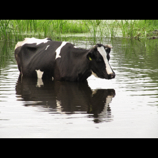
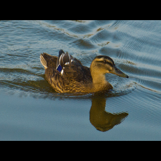
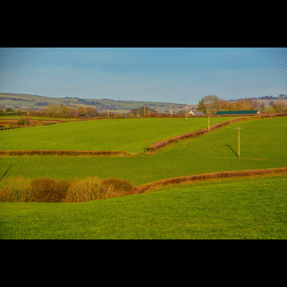
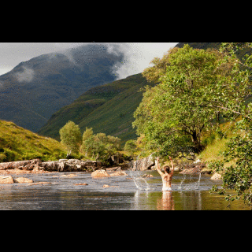
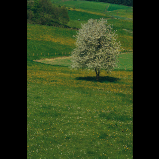
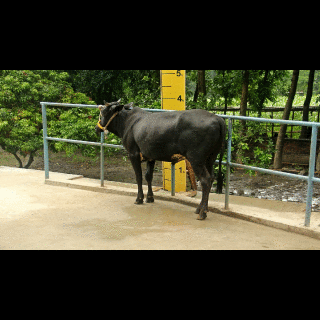
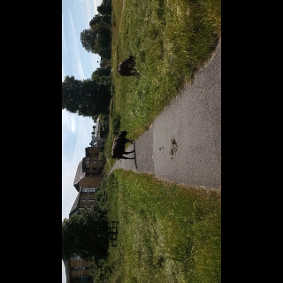
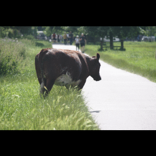
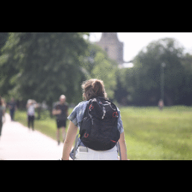
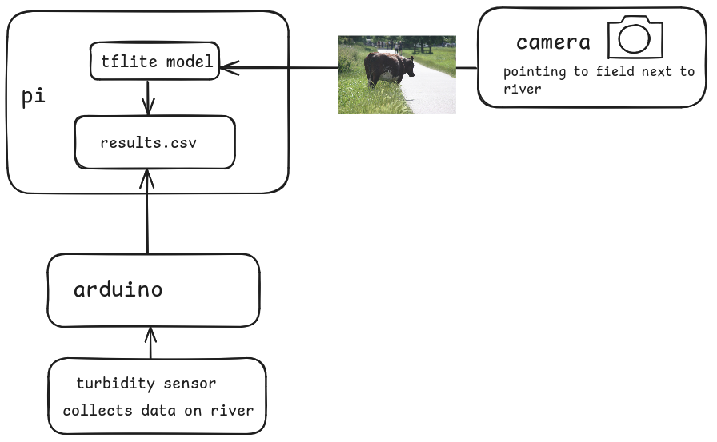

# Cows-vs-no-cows  

Detection of cows on a Raspberry Pi camera, for citizen scientists collecting data on river turbidity


## Description  
Neural network which detects whether there are cows or no cows in a photo, using TensorFlow. There are four parts to this:
* Data
* Model
* Inference test
* Application
### Data
Sources of data:
* scraping from Bing image search  
  
  
  
  
    
  As well as searching for cows in fields and empty fields, I made sure that the model wouldn't recognise empty space as lack of cows, by including photos of ducks, trees and people. I also included photos of cows around rivers so that the model wouldn't assume that a cow is only present if it is in a field.  
* a Kaggle dataset of cows  
    
  This dataset has photos of cows in many different orientations.
* videos I took of cows and no cows, then extracting images from here. This was to get a large number of my own photos quickly without taking each one individually  
    
  I changed the orientation here too.  
* photos I took of cows and no cows for the holdout set. Less overall than from videos but they are more varied
    
  An example of a photo of a cow that I took individually.  
    
  For the "no cows" data, I took photos of empty fields and also people to prevent it from confusing people with cows.
### Model
I used another project on GitHub that recognises whether there is a cat or a dog in the photo (https://github.com/0sparsh2/cats-vs-dogs-coursera-assignment/blob/main/Cats_vs_Dogs_CourseraAssignment.ipynb). Instead of training the model with the "cats vs dogs" dataset I used my own "cows vs no cows" dataset.
### Application  
The different parts of the application part are shown in the diagram below:


## How to use
### Training 
```
pip install -r training_requirements.txt
```
Download a dataset (please contact me if you wish to use my dataset) with two folders: photos of cows and photos without cows. Use a variety of photos including different angles of the cow(s), and different locations within both catagories.  
Split the data into a training and testing set, using splitdata.py.  
Train the model using cows.py. This script will arrange the data into something it can use, create a neural network, train all of the images in the training set 15 times over, and save the model.  
### Testing inference on computer
This is to give an idea of how accurate your model is.
```
pip install -r inference_requirements.txt
```
Test the model using inference.py. This script will load data from the holdout set and feed it into the model. The output will be two numbers, showing the certainty that the "cow" images contain cows, and the "no cow" images do not contain cows.  
Test the model in the field using a camera by running photos.py. This will take photos (number of photos currently set to 100) then put them through the model. The output of the script is a csv file called results.csv which contains the timestamp of each photo and whether cows have been detected in the photo or not.  
**TensorFow Lite**  
Use converter.py to convert the model to TensorFlow Lite. To do the inference, run inference_tflite.py. To test the model taking photos in real time, use photos_tflite.py.
### Testing inference on Raspberry Pi
This is how the project will work on the field.
```
pip install -r pi_requirements.txt
```
Run rpi-demo.py on the Raspberry Pi. This will test one image (cow.jpg) using the TensorFlow Lite model.

## Coming soon

* Better performance using dropout layers  
* Graphs showing the performance of the model  
* Script that takes photos and detects cows on the Pi
